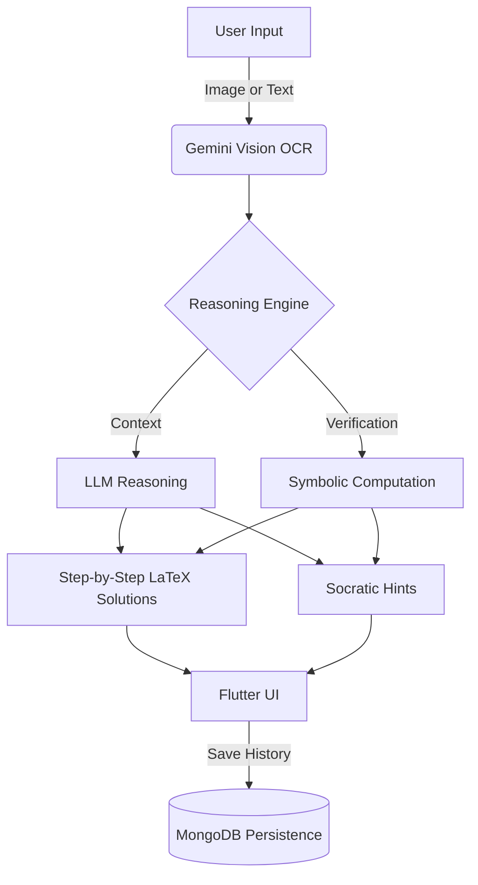

# 📘 Xolver — AI-Powered Math & Physics Solver

-blue)


**Xolver** is a multimodal educational application engineered to solve complex Math and Physics problems using advanced Computer Vision and Large Language Models.

Unlike standard solvers that simply dump answers, Xolver features a **Socratic “Hint Mode”** designed to guide users through the learning process without revealing the solution immediately. The app is built with a production-ready **FastAPI** backend and a **Flutter** frontend optimized for offline-first APK distribution.

---
## 📱 Demo APK
Try the Android app here:  
👉 **[Download APK](https://drive.google.com/file/d/1R-9cd2kbzgHyH6AqGqn3pOsgX1iRxqz1/view?usp=sharing)**

> _Note: This APK is provided for demonstration purposes. Full source code and implementation details are available in this repository._

---

## 📱 Interface & Features

#### 📸 Problem Capture
<p align="center">
  
</p>

---

#### 🧠 Step-by-Step Solution
<p align="center">
  
  
</p>

---

#### 💡 Socratic Hint Mode
<p align="center">
  
</p>

---

#### 🤖 AI Tutor Chat
<p align="center">
  
</p>

---

#### 📊 Analytics Dashboard
<p align="center">
  
</p>


## 🎯 Core Capabilities

### 1. 🖼️ Multimodal Input (OCR)
- **Snap & Solve:** Capture handwritten or printed problems via camera or gallery.
- **Vision Engine:** Powered by **Google Gemini Vision (Gemini 2.5 Flash)** for high-accuracy text and equation extraction.
- **Editable Input:** Extracted LaTeX/text is user-editable before solving to ensure correctness.

### 2. 🧠 AI-Powered Solver
- **Reasoning Engine:** Uses **Groq-hosted LLaMA 3.3 (70B)** to generate accurate final answers with detailed, step-by-step LaTeX explanations.
- **Context-Aware Tutor Chat:** Users can ask follow-up questions on individual solution steps.

### 3. 💡 Socratic “Hint Mode”
- **Active Learning:** Guides users through leading questions instead of revealing the solution.
- **Clean Separation:** Hint sessions are tracked independently from full solutions while remaining part of the learning history.

### 4. 📊 Topic Analytics & History
- **Auto-Classification:** Problems are categorized into syllabus topics (e.g., *Indefinite Integration, Rotational Mechanics*) using **LLaMA 3.1 (8B)**.
- **Dashboard:** Visual analytics of strengths and weak areas using `fl_chart`.
- **Persistence:** Full history stored in MongoDB with automatic UTC → IST timestamp conversion.

### 5. 🔐 Privacy-First Architecture
- **No Login Required:** Locally generated UUIDs (`shared_preferences`) handle user identity.
- **User Isolation:** Complete data separation without email/password friction.

---

## 🧩 Tech Stack

### 🖥️ Frontend (Flutter / Dart)
- **UI:** Material 3
- **Math Rendering:** `flutter_math_fork`
- **State & Local Storage:** `shared_preferences`, `uuid`
- **Networking:** `http`
- **Charts & Analytics:** `fl_chart`

### ⚙️ Backend (Python / FastAPI)
- **Framework:** FastAPI (async, high-performance)
- **Database:** MongoDB (Motor async client)
- **Hosting:** Render
- **Symbolic Validation (Fallback):** SymPy

### 🤖 AI Models & APIs
- **OCR / Vision:** Google Gemini 2.5 Flash
- **Solver LLM:** LLaMA 3.3 (70B) via Groq
- **Topic Classifier:** LLaMA 3.1 (8B)

---
## 🧩 System Architecture

The core pipeline of the application follows this flow:


---

## 🗄️ Database Schema (MongoDB)

User history supports both full-solution and hint-based workflows:

```json
{
  "_id": "ObjectId(...)",
  "user_id": "uuid-v4-string",
  "equation": "Raw text or LaTeX input",
  "solution": "Full step-by-step markdown response",
  "explanation": "Natural language summary",
  "topic": "Calculus",
  "mode_used": "solve",
  "hint_chat": [],
  "tutor_chat": [],
  "timestamp": "2024-12-15T10:30:00Z"
}

```

---
## 🚀 Installation & Setup

This project consists of a **Flutter Android frontend** and a **FastAPI backend** deployed on Render.

Repository:  
👉 https://github.com/monicathinakaran/vision-math-solver

---

## 🔧 Prerequisites

### 🖥️ Flutter SDK (3.x+)
- Official installation guide: https://docs.flutter.dev/get-started/install

Verify installation:
```bash
flutter doctor
```
### 🐍 Python (3.10+)

- Download Python: https://www.python.org/downloads/
- 
**Verify installation**:
```bash
python --version
```
**Install Flutter dependencies**
```bash
flutter pub get
```
**Run on emulator or physical device**
```bash
flutter run
```
### 🔑 API Keys Required

You need the following API keys for AI inference:

- **Groq API Key (LLaMA 3.3)**  
  https://console.groq.com/

- **Google Gemini API Key**  
  https://aistudio.google.com/app/apikey

---

### 🗄️ MongoDB Atlas

- Create a free MongoDB Atlas cluster:  
  https://www.mongodb.com/cloud/atlas
- Create a database user and whitelist your IP address
- Obtain your MongoDB connection string

---

## ⚙️ Backend Setup (FastAPI)

Clone the repository and navigate to the backend directory:

```bash
git clone https://github.com/monicathinakaran/vision-math-solver.git
cd vision-math-solver/backend
```
Install dependencies:
```bash
pip install -r requirements.txt
```
Create a .env file inside the backend directory:
```bash
GROQ_API_KEY=your_groq_api_key
GEMINI_API_KEY=your_gemini_api_key
MONGO_URI=your_mongodb_connection_string
```
Run the backend locally:
```bash
uvicorn main:app --reload
```
## 🌐 Deployed Backend
The production backend is deployed on **Render**:

👉 https://xolver-backend.onrender.com

## 📱 Frontend Setup (Flutter)

Navigate to the frontend directory and run:
```bash
cd ../frontend
flutter pub get
flutter run
```

The app is currently distributed as an Android APK
(offline-first frontend with online AI inference).

## 📦 Deployment & Limitations
**Deployment**

Backend: FastAPI deployed on Render

Frontend: Android APK distribution

**Current Limitations**

No cloud-based user accounts or cross-device synchronization

Active internet connection required for AI inference

iOS build has not been tested yet

